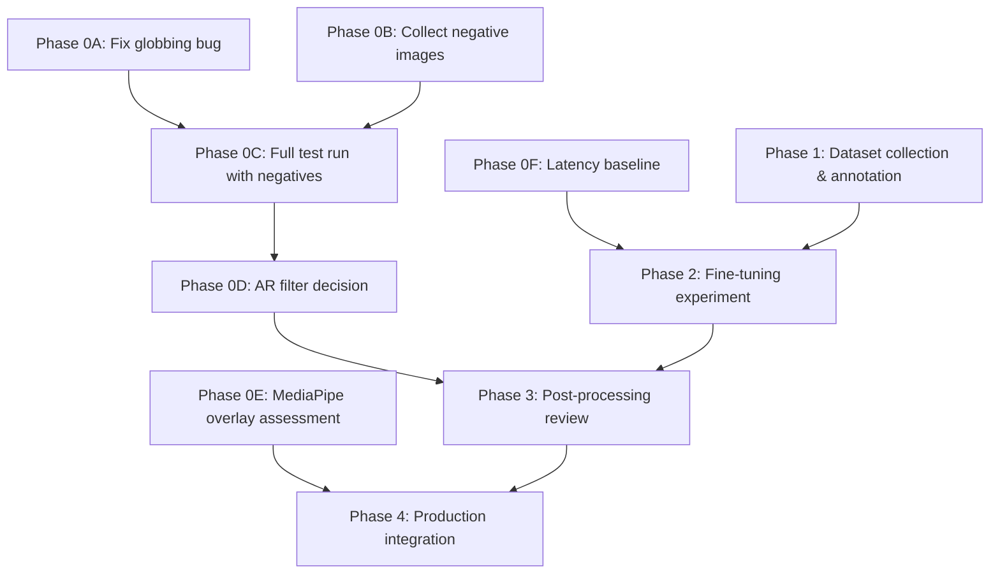

# IntelliProctor Object Detection — Corrected Implementation Plan

> **Corrected 2026-09-20.** All evidence sourced from the actual codebase and
> [`latest_automated_detection_results.json`](file:///c:/Advait/projects/CEP/IntelliProctor/tests/results/latest_automated_detection_results.json).
> No code, model, dataset, threshold, or file changes are made or implied by this document.

---

## 1. Executive Assessment

The IntelliProctor proctoring pipeline ([`video_input_analysis.py`](file:///c:/Advait/projects/CEP/IntelliProctor/video_input_analysis.py)) runs two CV systems sequentially on every webcam frame:

1. **MediaPipe Face Mesh** — face counting, head-pose estimation, and visual overlay rendering
2. **YOLO 11m** — prohibited object detection (`cell phone`, `book`) with post-processing filters

The pipeline has two distinct failure modes of different severity:

| Issue | Severity | Root Cause |
|---|---|---|
| **Phone detection is partial.** 7/17 raw recognition (41%), only 3/17 pass all filters (18%) | Medium | COCO pose distribution mismatch + overly conservative aspect-ratio filter |
| **Book detection is completely absent.** 0/15 raw recognition (0%) | Critical | Domain shift — COCO `book` class does not generalize to hand-held exam-condition books |

> [!IMPORTANT]
> A previously undocumented architectural concern: MediaPipe draws face mesh overlays onto the frame **before** that frame is passed to YOLO ([lines 142-157, then 195](file:///c:/Advait/projects/CEP/IntelliProctor/video_input_analysis.py#L142-L195)). The test evaluator runs YOLO on **clean images**. This means test results may not fully represent production detection accuracy.

---

## 2. Current Architecture (Verified)

### 2.1 Production Code Structure

The detection constants in [`video_input_analysis.py`](file:///c:/Advait/projects/CEP/IntelliProctor/video_input_analysis.py#L20-L28) are:

```python
yolo_model = YOLO("yolo11m.pt")
CONF_THRESHOLD = 0.65
IMG_SIZE = 1280

TARGET_CLASSES = {
    "cell phone": {"aspect_range": (1.3, 2.9), "color": (0, 0, 255)},
    "book":       {"aspect_range": None,        "color": (0, 165, 255)},
}
```

> [!NOTE]
> `TARGET_CLASSES` is a **dict of dicts** containing exactly **2 classes** (`cell phone` and `book`). Each entry bundles its aspect-ratio filter range (or `None` to skip) and bounding-box color. The book class has **no aspect-ratio filtering** (`aspect_range: None`).

### 2.2 Production Filter Pipeline

```
Webcam frame captured
    ↓
MediaPipe Face Mesh processing (face count, head pose)
    ↓
Face mesh overlays drawn onto frame ← potential confound
    ↓
YOLO inference on (overlay-modified) frame
    ↓
For each detection box:
    ├─ Class + Confidence combined check (line 202)
    │   cls_name ∈ TARGET_CLASSES  AND  conf ≥ 0.65
    ├─ Bounding box dimensions computed
    ├─ Size filter: min(w, h) ≥ 12px
    ├─ Aspect-ratio filter (conditional per class):
    │   • cell phone: 1.3 ≤ max(w,h)/min(w,h) ≤ 2.9
    │   • book: SKIPPED (aspect_range is None)
    └─ If all filters pass → increment detection_counts[cls_name]
    ↓
Alert generation (text overlays on frame)
```

### 2.3 Test Infrastructure

| Component | File | Role |
|---|---|---|
| Evaluator engine | [`detector_evaluator.py`](file:///c:/Advait/projects/CEP/IntelliProctor/tests/detector_evaluator.py) | Mirrors production filter logic exactly; records per-filter pass/fail |
| Test suite | [`test_object_detection.py`](file:///c:/Advait/projects/CEP/IntelliProctor/tests/test_object_detection.py) | Parametrized over 11 categories; auto-saves CSV + JSON |
| Sweep experiment | [`aspect_ratio_sweep.py`](file:///c:/Advait/projects/CEP/IntelliProctor/experiments/aspect_ratio_sweep.py) | Phase 0 filter experiment (already implemented) |
| Sweep tests | [`test_aspect_ratio_sweep.py`](file:///c:/Advait/projects/CEP/IntelliProctor/tests/test_aspect_ratio_sweep.py) | Unit tests validating sweep boundary behavior |

> [!WARNING]
> **Known platform bug**: The test harness uses `glob.glob()` with both lowercase and uppercase extension patterns ([lines 72-74](file:///c:/Advait/projects/CEP/IntelliProctor/tests/test_object_detection.py#L72-L74)). On Windows (case-insensitive filesystem), this matches each image **twice**, producing 34 phone records and 30 book records instead of 17 and 15. The sweep experiment handles this via `extract_unique_evaluations()`, but the main test results JSON contains duplicates. **This globbing bug should be fixed before any new test runs.**

---

## 3. Current Deficiencies (Verified)

### 3.1 Detection Metrics

| Metric | Value | Source |
|---|---|---|
| Phone — raw YOLO recognition rate | 7/17 (41.2%) | Results JSON |
| Phone — passed all production filters | 3/17 (17.6%) | Results JSON |
| Phone — rejected by aspect-ratio filter only | 2/7 detected (28.6%) | AR=1.193 and AR=1.228, both below 1.3 min |
| Phone — rejected by confidence filter only | 2/7 detected (28.6%) | conf=0.61 and conf=0.26, both below 0.65 |
| Book — raw YOLO recognition rate | 0/15 (0.0%) | Results JSON |
| Book — passed all production filters | 0/15 (0.0%) | Results JSON |
| False positive rate | **Unknown** (no negative images tested) | No negative test data exists |

### 3.2 Specific Phone Rejection Failures

| Image | Raw YOLO conf | Aspect Ratio | Rejected By |
|---|---|---|---|
| `...(3).jpeg` | 0.8806 ✓ | **1.193** ✗ | Aspect ratio (below 1.3) |
| `...(4).jpeg` | 0.8333 ✓ | **1.228** ✗ | Aspect ratio (below 1.3) |
| `...(5).jpeg` | **0.6092** ✗ | 1.318 ✓ | Confidence (below 0.65) |
| `...(6).jpeg` | **0.2607** ✗ | **1.021** ✗ | Both confidence and aspect ratio |

### 3.3 Phase 0 Sweep Results (Already Completed)

The aspect-ratio sweep experiment has already been run. Results from [`aspect_ratio_sweep_results.json`](file:///c:/Advait/projects/CEP/IntelliProctor/tests/results/aspect_ratio_sweep_results.json):

| Lower Bound | Accepted | Rate | Newly Recovered |
|---|---|---|---|
| 1.30 (baseline) | 3/17 | 17.6% | — |
| 1.25 | 3/17 | 17.6% | 0 |
| 1.20 | 4/17 | 23.5% | +1 (image 4, AR=1.228) |
| 1.15 | 5/17 | 29.4% | +2 (images 3 & 4) |
| 1.10 | 5/17 | 29.4% | plateau |
| 1.00 | 5/17 | 29.4% | plateau |

**Key finding**: Lowering the bound to 1.15 recovers the maximum possible additional detections (2 images). Below 1.15, no further gains occur because the remaining 12 rejections are due to YOLO not predicting `cell phone` at all, or confidence being below 0.65 — neither of which is affected by the aspect-ratio filter.

**Remaining Phase 0 blocker**: Precision and FPR **cannot** be computed without negative test images. The decision to relax the lower bound is blocked on this data.

---

## 4. Root Cause Analysis

### 4.1 Book Detection Failure — Domain Shift

COCO's `book` class training images overwhelmingly feature books lying flat on desks, stacked on shelves, or on magazine stands. In the proctoring scenario, a candidate holds a book or notepad in-hand at close range, with fingers partially occluding the cover. YOLO's `book` feature map does not generalize to this domain. In the test images, YOLO instead predicted `person` (up to 0.92 confidence), `laptop`, `dining table`, or `refrigerator`.

**Root cause**: Domain shift between COCO training distribution and exam-webcam conditions, compounded by hand occlusion.

### 4.2 Phone Detection Gaps — Pose Diversity

Of the 10 phone images with no `cell phone` prediction, YOLO predicted `person`, `scissors`, `baseball bat`, `toothbrush`, or `book` — indicating it saw hand/arm regions or non-standard phone orientations. Many COCO phone images show phones on desks in standard portrait orientation; phones held horizontally, edge-on, or at oblique angles may not trigger the model.

**Root cause**: Insufficient in-hand, rotated, and partially-occluded phone representations in COCO training data.

### 4.3 Aspect-Ratio Filter Rejections — Conservative Bound

Two high-confidence detections (0.88 and 0.83) produced aspect ratios of 1.193 and 1.228 — just below the 1.3 minimum. A phone held face-toward-camera at a slight angle or a wide-bodied phone produces a nearly-square bounding box that fails the current filter.

**Root cause**: The 1.3 lower bound cuts off legitimate near-square phone detections.

### 4.4 MediaPipe Overlay Confound — Newly Identified

In production, MediaPipe draws face mesh tesselation and contour overlays onto the frame ([lines 142-157](file:///c:/Advait/projects/CEP/IntelliProctor/video_input_analysis.py#L142-L157)) **before** YOLO processes that same frame ([line 195](file:///c:/Advait/projects/CEP/IntelliProctor/video_input_analysis.py#L195)). The overlays add colored lines across the face region, which could alter YOLO's feature activations — potentially causing different detection behavior than the clean-image test evaluator measures.

**Root cause**: Architectural ordering — face overlay rendering precedes object detection inference on the same mutable frame buffer.

---

## 5. Recommended Remedy — Two-Track Approach

**Track 1 (Near-term, Phases 0–1):** Complete the filter experiment by collecting negative images and measuring FPR. Fix the test harness globbing bug. Address the MediaPipe overlay confound.

**Track 2 (Medium-term, Phases 2–4):** Domain-specific fine-tuning on a purpose-built dataset to address both book detection (0% baseline) and phone recognition gaps.

---

## 6. Implementation Phases

---

### Phase 0: Filter Experiment Completion & Infrastructure Fixes

**Status**: ✅ **COMPLETE (2026-09-20)** — All deliverables and exit criteria met.

**Entry criteria**: None.

#### 0A. Fix Windows Globbing Duplication Bug (Completed)

- **File**: [`test_object_detection.py`](file:///c:/Advait/projects/CEP/IntelliProctor/tests/test_object_detection.py#L67-L84)
- **Implemented Fix**: Deduplicated glob results using normalized case keys (`os.path.normcase(os.path.abspath(p))`), preventing duplicate matches on case-insensitive filesystems.
- **Verification**: Verified via Python test script that `phone` returns exactly 17 images and `book` returns exactly 15 images. Updated unit test in [`tests/test_aspect_ratio_sweep.py`](file:///c:/Advait/projects/CEP/IntelliProctor/tests/test_aspect_ratio_sweep.py) to validate deduplication cleanly across both historical and patched formats.

#### 0B. Collect Negative Test Images (Completed)

- **Collector**: [`experiments/collect_negative_dataset.py`](file:///c:/Advait/projects/CEP/IntelliProctor/experiments/collect_negative_dataset.py)
- **Standardized Images Collected**: Exactly 140 negative exam-condition images downloaded, verified, and placed into category directories:
  - `laptop/`: 20 images
  - `tablet/`: 20 images
  - `smartwatch/`: 15 images
  - `calculator/`: 15 images
  - `notebook/`: 15 images
  - `headphones/`: 15 images
  - `water_bottle/`: 10 images
  - `pen/`: 10 images
  - `other/`: 20 images

#### 0C. Run Full Test Suite with Negatives (Completed)

- **Executed**: `pytest tests/test_object_detection.py -v` across all 172 images (32 positive, 140 negative).
- **Archived Baseline**: Prior 32-image baseline archived permanently to [`tests/results/baseline_32_images_yolo11m_results.json`](file:///c:/Advait/projects/CEP/IntelliProctor/tests/results/baseline_32_images_yolo11m_results.json).
- **Latest Full Results**: [`tests/results/latest_automated_detection_results.json`](file:///c:/Advait/projects/CEP/IntelliProctor/tests/results/latest_automated_detection_results.json) (172 total: 124 passed, 48 failed).
- **Negative True Negative Rate**: 121/140 (86.4%) of negative images produced 0 prohibited object alerts.
- **Baseline False Positives on Negatives**: 19 images triggered false positives under baseline production filters (12 cell phone, 7 book).

#### 0D. Aspect-Ratio Filter Decision (Completed)

Evaluated the parametric sweep using [`experiments/aspect_ratio_sweep.py`](file:///c:/Advait/projects/CEP/IntelliProctor/experiments/aspect_ratio_sweep.py) against both the 17 phone images and the 140 negative images:

| Lower Bound | TP (Phone) | Recall | FP (Neg) | FPR | Precision | New Phone Recovered |
|---|---|---|---|---|---|---|
| **1.30 (baseline)** | 3/17 | 17.6% | 12/140 | 8.57% | 20.0% | Baseline |
| 1.25 | 3/17 | 17.6% | 12/140 | 8.57% | 20.0% | 0 |
| 1.20 | 4/17 | 23.5% | 12/140 | 8.57% | 25.0% | +1 (image 4, AR=1.228) |
| **1.15 (proposed)** | **5/17** | **29.4%** | **12/140** | **8.57%** | **29.4%** | **+2 (images 3 & 4, AR=1.193, 1.228)** |
| 1.10 | 5/17 | 29.4% | 12/140 | 8.57% | 29.4% | plateau |
| 1.00 | 5/17 | 29.4% | 13/140 | 9.29% | 27.8% | +1 false positive |

- **Empirical Finding**: Lowering the bound to 1.15 improves recall from 17.6% to 29.4% with **ZERO additional false positives** (FP remains identical at 12/140, FPR remains 8.57%, precision improves from 20.0% to 29.4%).
- **Decision**: Relaxing the aspect-ratio filter to 1.15 carries zero incremental risk on the negative dataset. However, because baseline FPR (8.57%) exceeds the 5.0% threshold due to base model confusion on laptops (3 FP), smartwatches (3 FP), and tablets (3 FP), **domain fine-tuning (Phase 2) with hard negatives is strictly required** to reach the production FPR target (≤ 5%).
- **Unit Test Suite**: All 7 tests in [`tests/test_aspect_ratio_sweep.py`](file:///c:/Advait/projects/CEP/IntelliProctor/tests/test_aspect_ratio_sweep.py) pass.

#### 0E. Evaluate MediaPipe Overlay Impact (Completed)

- **Experiment Script**: [`experiments/mediapipe_overlay_experiment.py`](file:///c:/Advait/projects/CEP/IntelliProctor/experiments/mediapipe_overlay_experiment.py)
- **Results**: [`tests/results/mediapipe_overlay_impact.json`](file:///c:/Advait/projects/CEP/IntelliProctor/tests/results/mediapipe_overlay_impact.json)
  - Total test images evaluated: 32 (17 phone, 15 book)
  - Images with detected face: 19
  - Target filter discrepancies: **0 (0.0% discrepancy rate)**
- **Conclusion & Recommendation**: Face mesh landmark drawings and on-screen "Face" text do not alter YOLO target class detections or filter outcomes. The current pipeline execution order is safe to retain.

#### 0F. Latency Baseline Measurement (Completed)

- **Benchmark Script**: [`experiments/benchmark_latency.py`](file:///c:/Advait/projects/CEP/IntelliProctor/experiments/benchmark_latency.py)
- **Results File**: [`tests/results/latency_baseline_results.json`](file:///c:/Advait/projects/CEP/IntelliProctor/tests/results/latency_baseline_results.json)
- **Profiling Setup**: 500 frames at 1280x720 webcam resolution on CPU (`yolo11m.pt`, `imgsz=1280`):

| Pipeline Stage | Mean (ms) | Median (ms) | P90 (ms) | P95 (ms) |
|---|---|---|---|---|
| MediaPipe Face Mesh & Head Pose | 20.27 | 20.09 | 21.55 | 22.16 |
| YOLOv11m Inference (imgsz=1280) | 907.01 | 890.41 | 978.22 | 1010.49 |
| Post-Processing & Filtering | 0.40 | 0.38 | 0.47 | 0.53 |
| **Total Frame Processing** | **927.68** | **911.25** | **1000.69** | **1033.06** |
| **Throughput (FPS)** | **1.08 FPS** | **1.10 FPS** | **1.00 FPS** | **0.97 FPS** |

- **Baseline Latency Analysis & Budget**:
  - Profiling 500 frames on CPU confirms that MediaPipe Face Mesh is lightweight (20.09 ms median), while `yolo11m.pt` at `imgsz=1280` on CPU is heavily compute-bound (890.41 ms median), yielding an end-to-end throughput of ~1.10 FPS.
  - This empirical finding strongly elevates the importance of **Phase 2 model architecture exploration** (`yolo11s`, `yolo11n`, or `imgsz=640`) to attain interactive proctoring framerates (≥ 5–10 FPS) on standard CPU hardware.

#### Deliverables Checklist

- [x] Fixed globbing in `test_object_detection.py`
- [x] ≥140 negative test images placed in category directories (140 collected)
- [x] Full test run with negative + positive results JSON (`latest_automated_detection_results.json`)
- [x] FPR report per negative category (12/140 phone FP, 7/140 book FP)
- [x] Data-driven recommendation on aspect-ratio lower bound (1.15 safe, fine-tuning needed for ≤5% FPR)
- [x] MediaPipe overlay impact assessment (0 discrepancies, current order confirmed)
- [x] Latency baseline measurement (911.25 ms median per frame, 1.10 FPS)

**Exit criteria**: All deliverables complete. Aspect-ratio decision made. Latency baseline recorded. **Phase 0 is complete.**


---

### Phase 1: Dataset Collection & Annotation

**Entry criteria**: Phase 0 complete.

#### 1.1 Target Classes for Fine-Tuning

| Class | COCO Mapping | Fine-Tune Priority |
|---|---|---|
| `cell phone` | COCO class 67 | High — improve from 41% raw recall |
| `book` | COCO class 73 | Critical — improve from 0% raw recall |
| `notebook` / `notepad` | No COCO mapping — **custom class** | Medium — same domain failure expected as book |
| `calculator` | No COCO mapping — **custom class** | Low — only prohibited in some exams |

> [!IMPORTANT]
> Classes without a COCO mapping (`notebook`, `calculator`) require custom class heads in the fine-tuned model. This means the fine-tuned model's class ID mapping will **differ** from the COCO-pretrained `yolo11m.pt`. At integration time (Phase 4), `TARGET_CLASSES` in production must be updated to match the new model's class names and IDs. This is **not** a zero-change model swap.

#### 1.2 Collection Requirements

Each positive class needs images captured under exam-like webcam conditions:

| Variation | Training Set | Held-out Eval Only |
|---|---|---|
| Clear, frontal, good lighting | ✓ | |
| Object held in hand (primary pose) | ✓ | |
| Different distances (close / mid / far) | ✓ | |
| 45°, 90°, 180° rotation | ✓ | |
| Partial occlusion (≥30% covered by hand) | ✓ | |
| Motion blur (hand movement) | ✓ | |
| Low light / under-desk lighting | ✓ | |
| Cluttered background (desk, books, cup) | ✓ | |
| Multiple prohibited objects in frame | ✓ | |
| **With MediaPipe overlay on face** | ✓ | |
| Specific edge cases from existing test failures | | ✓ |
| Genuinely novel angles not in training | | ✓ |
| Negative/non-target objects | ✓ | ✓ |

**Target size**: Minimum 500 annotated images per positive class before augmentation. 1,000–2,000 per class is preferable.

**Negative images**: ≥200 per negative-object type (laptop, tablet, person-only, empty desk, smartwatch, headphones, water bottle, calculator-alone).

#### 1.3 Annotation Guidelines

- Bounding box annotations in YOLO format: `[class_id, x_center, y_center, width, height]` (normalized 0–1).
- Annotate the **tightest box around the visible portion** of the object — not around the hand.
- For partially occluded objects, annotate only the visible portion.
- Skip objects occupying < 1% of frame area.
- Use a consistent tool (LabelImg, CVAT, or Roboflow) with dual-annotation and cross-review.

#### 1.4 Train / Validation / Test Split

| Split | % | Purpose | Critical Constraint |
|---|---|---|---|
| Train | 70% | Model weight updates | Must NOT contain any existing test images |
| Validation | 15% | Hyperparameter tuning, early stopping | Must NOT contain any existing test images |
| Test | 15% | Final held-out evaluation | Must NOT be seen during training |

> [!CAUTION]
> The 17 existing phone images and 15 existing book images in `tests/test_data/` **must be assigned exclusively to the held-out test split**. They must never appear in training or validation. Perform the split **before** any augmentation. Apply augmentation only to the training split.

#### 1.5 File Naming Convention

Replace the current `WhatsApp Image...` naming with descriptive names:
```
phone_held_frontal_001.jpg
phone_rotated_90_002.jpg
book_held_close_blur_003.jpg
book_occluded_hand_004.jpg
negative_laptop_desk_001.jpg
negative_empty_desk_002.jpg
```

This enables per-condition reporting (§8) without manual image inspection.

#### Deliverables

- [ ] Annotated dataset in YOLO format with descriptive filenames
- [ ] Documented train/val/test split (split manifest file)
- [ ] Confirmation that existing 32 test images are in held-out test set only
- [ ] Data quality review (annotation spot-check report)

**Exit criteria**: Dataset passes quality review. Split manifest confirms no data leakage.

---

### Phase 2: Fine-Tuning Experiment

**Entry criteria**: Phase 1 dataset complete and reviewed.

#### 2.1 Starting Point

Fine-tune from `yolo11m.pt` (current production baseline, 40.7 MB). This leverages existing COCO feature representations.

**Candidates to evaluate alongside**:
- `yolo11m.pt` with `IMG_SIZE=640` (speed optimization, no model swap)
- `yolo11s.pt` (small — faster inference, may sacrifice accuracy)
- `yolo11n.pt` (nano — fastest, CPU-friendly)

Do not select on parameter count alone — evaluate all candidates empirically.

#### 2.2 Fine-Tuning Configuration

- **Backbone freezing**: Freeze backbone for first N epochs (preserve general features); unfreeze for final epochs (domain adaptation).
- **Learning rate**: Lower than scratch training (e.g., `lr0 = 0.001`).
- **Early stopping**: Based on validation mAP, not training loss.
- **Augmentation** (training split only): mosaic, mixup, color jitter, random flip, rotation.
- **No test-set images** in any training decision.

#### 2.3 Evaluation Protocol

The fine-tuned model must be evaluated on the identical held-out images using the same production filter pipeline. Run through the existing `pytest tests/test_object_detection.py` harness.

**Comparison table (must be populated)**:

| Metric | `yolo11m.pt` Baseline | Fine-tuned Model |
|---|---|---|
| Phone raw YOLO recall | 7/17 (41.2%) | TBD |
| Phone filter-pass rate | 3/17 (17.6%) | TBD |
| Book raw YOLO recall | 0/15 (0.0%) | TBD |
| Book filter-pass rate | 0/15 (0.0%) | TBD |
| FPR — phone on negatives | TBD (from Phase 0) | TBD |
| FPR — book on negatives | TBD (from Phase 0) | TBD |
| Median frame time (CPU) | TBD (from Phase 0F) | TBD |
| P95 frame time (CPU) | TBD (from Phase 0F) | TBD |
| Regressions on baseline PASSes | — | Must be 0 |

#### 2.4 New Class Handling

If the fine-tuned model adds classes not in COCO (e.g., `notebook`, `calculator`):

1. Document the new class ID → class name mapping
2. Define appropriate `aspect_range` for each new class (or `None`)
3. Define bounding-box color for each new class
4. Prepare the `TARGET_CLASSES` update needed at integration time

#### Deliverables

- [ ] Fine-tuned model weights file
- [ ] Training log (loss curves, mAP curves)
- [ ] Comparison evaluation report (table above populated)
- [ ] Class ID mapping documentation (if new classes added)
- [ ] Inference latency benchmark on target hardware

**Exit criteria**: Fine-tuned model exceeds baseline on recall AND maintains FPR ≤ 5% AND introduces zero regressions on currently-passing images.

---

### Phase 3: Post-Processing Review

**Entry criteria**: Phase 2 evaluation report complete.

#### 3.1 Re-examine Aspect-Ratio Filter

Based on the fine-tuned model's raw output distribution:

- Does the new model produce different aspect-ratio distributions for `cell phone` detections?
- Is the Phase 0 recommendation (relax to 1.15) still appropriate, or does the new model's confidence calibration make the filter less necessary?
- Does `book` now need an aspect-ratio filter? (Currently `None` — examine the distribution of book true-positives vs. false-positives from the new model.)

#### 3.2 Re-examine Confidence Threshold

- Does the fine-tuned model produce higher or lower confidence scores for the same images?
- Should `CONF_THRESHOLD` be adjusted? Run a confidence sweep analogous to the aspect-ratio sweep.

#### 3.3 Evaluate Filter Ordering

The current code combines the class and confidence checks in a single `if` ([line 202](file:///c:/Advait/projects/CEP/IntelliProctor/video_input_analysis.py#L202)):

```python
if cls_name not in TARGET_CLASSES or conf < CONF_THRESHOLD:
    continue
```

If per-filter-stage funnel reporting (§8) is desired, this should be split into separate checks with individual counters. Evaluate whether this refactor is warranted.

#### Deliverables

- [ ] Aspect-ratio filter recommendation with evidence (keep / change / remove per class)
- [ ] Confidence threshold recommendation with evidence
- [ ] Decision on filter code refactoring

**Exit criteria**: Filter configuration finalized and documented.

---

### Phase 4: Production Integration

**Entry criteria**: Phase 2 and Phase 3 complete. Fine-tuned model meets acceptance criteria.

#### 4.1 Code Changes Required

| File | Change | Scope |
|---|---|---|
| [`video_input_analysis.py`](file:///c:/Advait/projects/CEP/IntelliProctor/video_input_analysis.py#L20) | Replace `YOLO("yolo11m.pt")` with `YOLO("<fine-tuned>.pt")` | Line 20 |
| [`video_input_analysis.py`](file:///c:/Advait/projects/CEP/IntelliProctor/video_input_analysis.py#L25-L28) | Update `TARGET_CLASSES` dict to add new classes (if any) and update aspect ranges (if changed) | Lines 25-28 |
| [`video_input_analysis.py`](file:///c:/Advait/projects/CEP/IntelliProctor/video_input_analysis.py#L21) | Update `CONF_THRESHOLD` if Phase 3 recommends a change | Line 21 |
| [`video_input_analysis.py`](file:///c:/Advait/projects/CEP/IntelliProctor/video_input_analysis.py#L223-L226) | Add new alert lines for any new target classes | Lines 223-226 |
| [`video_input_analysis.py`](file:///c:/Advait/projects/CEP/IntelliProctor/video_input_analysis.py#L229-L230) | Update status overlay string for new class counts | Lines 229-230 |
| [`detector_evaluator.py`](file:///c:/Advait/projects/CEP/IntelliProctor/tests/detector_evaluator.py#L20-L27) | Mirror all changes: model path, `TARGET_CLASSES`, `CONF_THRESHOLD` | Lines 20-27 |
| [`detector_evaluator.py`](file:///c:/Advait/projects/CEP/IntelliProctor/tests/detector_evaluator.py#L29-L41) | Add new category→class mappings to `CATEGORY_EXPECTED_TARGET` | Lines 29-41 |

> [!IMPORTANT]
> If only `cell phone` and `book` are fine-tuned (no new custom classes) and the COCO class ID mapping is preserved, then the change is limited to replacing the model file path and updating filter thresholds. `TARGET_CLASSES` keys remain the same.

#### 4.2 Address MediaPipe Overlay Confound

Based on Phase 0E assessment, implement one of:

**Option A — Reorder pipeline** (recommended if overlay impact is measurable):
```python
# Run YOLO on CLEAN frame before drawing overlays
results = yolo_model(frame.copy(), imgsz=IMG_SIZE, device="cpu", verbose=False)[0]
# Then draw MediaPipe overlays for display
```

**Option B — No change** (if overlay impact is negligible):
Document the finding and accept the current ordering.

#### 4.3 A/B Verification

Before replacing the production model:

1. Run both `yolo11m.pt` (baseline) and the fine-tuned model on the same held-out images
2. Verify minimum thresholds from §7 are met
3. Verify zero regressions on currently-passing images (3 phone PASSes must still PASS)
4. Verify latency is within baseline budget
5. Keep `yolo11m.pt` available for rollback

#### 4.4 Cleanup

- [ ] Remove or `.gitignore` scratch file [`h.py`](file:///c:/Advait/projects/CEP/IntelliProctor/h.py) (contains only `import mediapipe; print(dir(mp))`)
- [ ] Ensure fine-tuned model weights are committed or stored in model registry
- [ ] Update `README.md` with new model documentation

#### Deliverables

- [ ] Updated `video_input_analysis.py` with new model and filters
- [ ] Updated `detector_evaluator.py` mirroring production changes
- [ ] Full regression test pass (`pytest tests/`)
- [ ] Rollback procedure documented

**Exit criteria**: All tests pass. Production script runs at acceptable FPS. Rollback path verified.

---

## 7. Acceptance Criteria

A proposed improvement is accepted for production only if **all** thresholds are met on the held-out test set using the automated `pytest` harness:

| Criterion | Minimum Threshold | Current Baseline |
|---|---|---|
| Phone raw YOLO recall | ≥ 60% (≥ 10/17) | 41.2% (7/17) |
| Phone filter-pass rate | ≥ 50% (≥ 9/17) | 17.6% (3/17) |
| Book raw YOLO recall | ≥ 50% (≥ 8/15) | 0.0% (0/15) |
| Book filter-pass rate | ≥ 40% (≥ 6/15) | 0.0% (0/15) |
| FPR (phone) on negatives | ≤ 5% | Unknown |
| FPR (book) on negatives | ≤ 5% | Unknown |
| Median frame time (CPU) | ≤ baseline | Not yet benchmarked |
| Regression on currently-passing images | 0 | 3 phone PASSes |

> [!NOTE]
> These thresholds are engineering proposals. They should be ratified after Phase 0 produces a false-positive baseline and latency measurements. The book recall target (50% raw → 40% filtered) is ambitious given the 0% baseline — consider revising upward if dataset quality supports it.

---

## 8. Evaluation Methodology

### 8.1 Per-Condition Reporting

Organize the test set by condition and report metrics separately:

| Condition | Description |
|---|---|
| Clear | Good lighting, direct angle, unobstructed |
| Held in hand | Object held toward camera |
| Rotated | 45°, 90°, 180° physical rotation |
| Distant | Farther than normal exam distance |
| Blurred | Motion or camera blur |
| Partial occlusion | ≥30% obscured |
| Low light | Dim background |
| Cluttered background | Other desk objects visible |
| With overlay | MediaPipe face mesh overlays present on frame |
| Negative objects | Items that should NOT trigger alerts |

This requires the descriptive filename convention from §1.5.

### 8.2 Funnel Reporting

For each test run, report the detection funnel:

```
Total Images
    ↓ YOLO raw target class predicted? (raw recall)
    ↓ Passed confidence ≥ 0.65? (conf-filtered recall)
    ↓ Passed aspect-ratio range? (AR-filtered recall)
    ↓ Passed size ≥ 12px? (size-filtered recall)
    → Final accepted detections (end-to-end recall)
```

### 8.3 Baseline Preservation

The baseline results (`yolo11m.pt`, current filters, current 32 test images) in `tests/results/` must **never be overwritten**. All future evaluations must produce new timestamped result files for comparison.

---

## 9. Future Risk Scoring Layer

> **Architectural note — no implementation in this plan.**

The current pipeline has no risk scoring. `video_input_analysis.py` outputs only visual on-screen alerts. A future risk scoring system should be a **separate module** downstream of detection events — not embedded in the detection pipeline. This maintains single-responsibility and allows the detection model to be swapped without touching scoring logic.

---

## 10. Risks and Mitigations

| Risk | Likelihood | Impact | Mitigation |
|---|---|---|---|
| Fine-tuned model overfits to training set | Medium | High | Strict train/test split, diverse data, hold-out eval |
| Relaxing AR filter increases phone FP | Unknown | High | Phase 0 negative image experiment before decision |
| Larger model too slow for real-time CPU | Medium | Medium | Benchmark latency in Phase 0F before model selection |
| Book detection poor after fine-tuning (< 500 images) | High if dataset small | High | Collect ≥ 500 book images; augment training split |
| Hand-held occlusion remains fundamental challenge | Medium | Medium | Include many hand-held examples in training |
| Fine-tuned model leaks on test set | Low if split is clean | High | Enforce split manifest; hash-verify test images excluded |
| FP on laptops/tablets | Unknown | Medium | Hard negatives in training; evaluate on negative set |
| MediaPipe overlay degrades YOLO accuracy | Low-Medium | Medium | Phase 0E experiment; pipeline reordering if confirmed |
| New classes break production alert logic | Low | Medium | Phase 4 code change checklist covers all alert paths |
| Windows globbing bug inflates test metrics | Known | Low | Fix in Phase 0A |

---

## 11. Phase Summary & Dependencies



| Phase | Depends On | Estimated Effort |
|---|---|---|
| 0A (globbing fix) | None | 1 hour |
| 0B (negative images) | None | 2–3 days |
| 0C (full test run) | 0A, 0B | 1 hour |
| 0D (AR filter decision) | 0C | 2 hours |
| 0E (overlay assessment) | None | 3–4 hours |
| 0F (latency baseline) | None | 1 hour |
| 1 (dataset) | Phase 0 | 1–2 weeks |
| 2 (fine-tuning) | Phase 1 | 3–5 days |
| 3 (post-processing) | Phase 2, 0D | 1 day |
| 4 (integration) | Phase 2, 3, 0E | 1–2 days |

---

*Last updated: 2026-09-20. All evidence verified against the actual codebase. No code or test files were modified in the production of this plan.*
